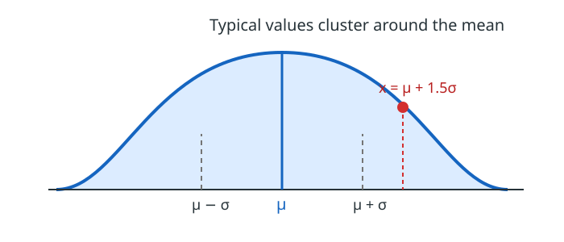

# Stage 4: Preprocessing

## Goal

By the end, you will be able to:

- Resize an image to the input size a model expects.
- Convert `uint8` pixels from `0…255` to `float32` pixels from `0.0…1.0`.
- Explain mean/std normalization as measuring each channel relative to typical training data.
- Apply different mean and standard-deviation values to each color channel.
- Convert an image from HWC to CHW without mixing up color order.

## Intuition

A neural network does not see an image file. It sees an array of numbers, and
it expects those numbers to have the same shape, channel order, and scale as
the images used during training.

Preprocessing is the small adapter between a camera image and that model:

```text
camera image (H, W, 3), uint8, BGR
        │
        ├─ resize ──────> required spatial size
        ├─ convert ─────> float32
        ├─ divide by 255 → values near 0 to 1
        ├─ mean/std ───> values centered and scaled per channel
        └─ transpose ──> (3, H, W), often called CHW
```

The exact recipe is part of a model's contract. A model trained on RGB input
with one mean/std set can make poor predictions if given BGR input or a
different normalization recipe.

## 1. Resize

Models need fixed-size tensors because their layers expect a known shape. For
example:

```python
resized = cv2.resize(image, (256, 256))  # OpenCV uses (width, height)
```

Resizing changes the image's spatial detail. It does not change the number of
color channels. Later, a tracker will use carefully chosen template and search
crops before resizing; for now, focus on the tensor conversion.

## 2. Convert `uint8` to `float32` and scale

OpenCV usually gives you `uint8` values from 0 to 255. First convert the data
type, then divide:

```python
scaled = image.astype(np.float32) / 255.0
```

Do the conversion first. Dividing a `uint8` array directly currently produces
floats in NumPy, but writing the conversion makes the intended model input
explicit and avoids accidental integer arithmetic in other operations.

After this step:

| Original `uint8` | Scaled `float32` |
| --- | --- |
| `0` | `0.0` |
| `128` | about `0.502` |
| `255` | `1.0` |

This is often called *scaling* or *0–1 normalization*. It is not yet the
mean/std normalization used by many pretrained networks.

## 3. Mean and standard deviation

### The simple idea first

Imagine that a model has practised with a huge collection of training images.
For each color channel, we can ask two simple questions:

| Question | Name | Plain meaning |
| --- | --- | --- |
| What value is usual? | **mean** | The average value. |
| How far from usual are values normally? | **standard deviation** (`std`) | The usual amount of wiggle. |

Mean/std normalization turns a pixel into an answer to this question:

> Is this pixel darker or brighter than usual, and by how many usual-sized steps?

After normalization:

- A value near `0` is typical.
- A negative value is below the usual value.
- A positive value is above the usual value.
- A value of `2` means “about two usual-sized steps above average.”

We write the calculation as:

`z = (x - μ) / σ`

where `x` is one scaled pixel value, `μ` (say “mu”) is the mean, `σ` (say
“sigma”) is the standard deviation, and `z` is the final normalized value.



The curve is a picture of the same idea: values near `μ` are usual, while
values farther away are less usual. The red point is `1.5σ` above the mean, so
its normalized value is `1.5`.

### One pixel, in two easy steps

Suppose a scaled pixel value is `x = 0.8`. The training images have mean
`μ = 0.5` and standard deviation `σ = 0.2`.

```text
Step 1: subtract what is usual
0.8 - 0.5 = 0.3

Step 2: measure that difference in usual-sized steps
0.3 / 0.2 = 1.5
```

The answer is `1.5`: this pixel is brighter than average by one and a half
usual-sized steps. Notice that we did **not** make the result stay between 0
and 1. Negative values and values larger than 1 are normal after this step.

Here is the same idea with several values when `μ = 0.5` and `σ = 0.2`:

| Scaled pixel `x` | Calculation | Normalized value `z` | Meaning |
| --- | --- | --- | --- |
| `0.3` | `(0.3 - 0.5) / 0.2` | `-1.0` | One typical variation below average |
| `0.5` | `(0.5 - 0.5) / 0.2` | `0.0` | Exactly average |
| `0.7` | `(0.7 - 0.5) / 0.2` | `1.0` | One typical variation above average |
| `0.8` | `(0.8 - 0.5) / 0.2` | `1.5` | One and a half typical variations above average |

### Where do these two numbers come from?

They are calculated once from the **training dataset**: the large collection
of images used to teach the model. They are calculated separately for red,
green, and blue. They do **not** come from the one camera frame you are using
right now.

The mean is ordinary average math:

`mean = (add all channel values) / (number of channel values)`

To find standard deviation, a program does this:

1. Find the mean.
2. Find each value's distance from the mean.
3. Square the distances, so below-average and above-average values do not cancel out.
4. Average those squared distances.
5. Take the square root to return to the original value scale.

You do not need to calculate this by hand when running a model. Use the mean
and std values published with that model, because it learned using that exact
recipe.

### Why subtract the mean?

Raw scaled image values are positive: they sit between 0 and 1. Subtracting
the mean moves the usual value to zero. That gives the network a predictable
middle point instead of making it first work around a positive offset.

### Why divide by the standard deviation?

Different channels can have different amounts of usual wiggle. Dividing by
`σ` makes one usual-sized change become roughly `1` in every channel. This
puts the channels on comparable scales.

### Mean/std is per channel

An RGB image uses three means and three standard deviations:

```python
mean = np.array([0.485, 0.456, 0.406], dtype=np.float32)
std = np.array([0.229, 0.224, 0.225], dtype=np.float32)
normalized = (scaled - mean) / std
```

Because `mean` and `std` have shape `(3,)`, NumPy broadcasts them across every
pixel in an HWC image. These particular numbers are common for models trained
on ImageNet RGB images, but they are **not universal defaults**. Always use the
values and channel order specified by the model you run.

!!! warning
    If your image is BGR, `[0.485, 0.456, 0.406]` is not automatically the
    right order. Convert BGR → RGB first, or reverse the mean/std values when
    the model explicitly expects BGR.

## 4. HWC to CHW

Many Python deep-learning models expect a single image in CHW order:

```python
chw = normalized.transpose(2, 0, 1)
```

`transpose(2, 0, 1)` changes axis order; it does not change the pixel values.
The numbers say which old axis becomes each new axis:

```text
new axis 0 ← old axis 2  → channels
new axis 1 ← old axis 0  → height
new axis 2 ← old axis 1  → width
```

For example, `(100, 200, 3)` becomes `(3, 100, 200)`. The same pixel can be
read with either ordering:

```python
normalized[y, x, c] == chw[c, y, x]
```

To convert CHW data back to HWC, reverse the axis order:

```python
hwc = chw.transpose(1, 2, 0)
```

For model batches, add a batch axis to get NCHW:

```python
batch = chw[None, :, :, :]  # shape: (1, 3, H, W)
```

`N` means the number of images. Here there is one image, so `N = 1`.
`None` creates this new first axis; the shorter `chw[None]` means the same
thing.

To make a batch of eight images, stack eight CHW tensors on that new axis:

```python
one_image_batch = chw[None]                    # shape: (1, 3, H, W)
eight_image_batch = np.stack([chw] * 8, axis=0)  # shape: (8, 3, H, W)
```

The example repeats `chw` only to show the shape. In real inference, each
item is a different preprocessed image.

## Runnable example

Run this from the repository root:

```bash
uv run python examples/stage4_preprocessing.py
```

It uses one known BGR pixel `[0, 128, 255]`, scales it, applies per-channel
mean/std values, and verifies the result.

## Hands-on exercise

1. Calculate `(1.0 - 0.5) / 0.25` by hand. What does it mean?
2. Change the example's `mean` to `[0.0, 0.0, 0.0]`. Which preprocessing step disappears?
3. Change `std` to `[1.0, 1.0, 1.0]`. Which preprocessing step disappears?
4. Print the batch shape after adding the `None` axis.

## Review quiz

<form class="quiz" data-answer="a" data-explanation="The model's learned weights expect a fixed input shape, so preprocessing resizes each input to that shape.">
  <fieldset>
    <legend>1. Why do we resize an image before model inference?</legend>
    <label><input type="radio" name="q1" value="a"> To match the spatial input shape expected by the model</label><br>
    <label><input type="radio" name="q1" value="b"> To change BGR into RGB</label><br>
    <label><input type="radio" name="q1" value="c"> To create more color channels</label>
  </fieldset>
  <button type="button" class="quiz-check">Check answer</button>
  <p class="quiz-result" aria-live="polite"></p>
</form>

<form class="quiz" data-answer="c" data-explanation="Scaling maps 0 to 0.0 and 255 to 1.0; it does not use the training-data mean or standard deviation.">
  <fieldset>
    <legend>2. What does <code>image.astype(np.float32) / 255.0</code> do?</legend>
    <label><input type="radio" name="q2" value="a"> Applies the model's mean and standard deviation</label><br>
    <label><input type="radio" name="q2" value="b"> Converts HWC to CHW</label><br>
    <label><input type="radio" name="q2" value="c"> Converts pixels to floats on an approximately 0.0 to 1.0 scale</label>
  </fieldset>
  <button type="button" class="quiz-check">Check answer</button>
  <p class="quiz-result" aria-live="polite"></p>
</form>

<form class="quiz" data-answer="b" data-explanation="Subtracting the mean makes values near the training-data average become close to zero.">
  <fieldset>
    <legend>3. In <code>(x - mean) / std</code>, what is the role of subtracting <code>mean</code>?</legend>
    <label><input type="radio" name="q3" value="a"> It changes the number of image channels.</label><br>
    <label><input type="radio" name="q3" value="b"> It centers typical values around zero.</label><br>
    <label><input type="radio" name="q3" value="c"> It changes an image from BGR to RGB.</label>
  </fieldset>
  <button type="button" class="quiz-check">Check answer</button>
  <p class="quiz-result" aria-live="polite"></p>
</form>

<form class="quiz" data-answer="a" data-explanation="The standard deviation describes typical variation. Dividing by it expresses each channel in comparable standard-deviation units.">
  <fieldset>
    <legend>4. Why divide by <code>std</code>?</legend>
    <label><input type="radio" name="q4" value="a"> To put channel variation on comparable scales</label><br>
    <label><input type="radio" name="q4" value="b"> To add a batch dimension</label><br>
    <label><input type="radio" name="q4" value="c"> To make every pixel equal to zero</label>
  </fieldset>
  <button type="button" class="quiz-check">Check answer</button>
  <p class="quiz-result" aria-live="polite"></p>
</form>

<form class="quiz" data-answer="c" data-explanation="The model's training recipe defines both channel order and mean/std values. BGR data with RGB statistics mixes up the channels.">
  <fieldset>
    <legend>5. What must match when using a pretrained model's mean/std values?</legend>
    <label><input type="radio" name="q5" value="a"> Only image width and height</label><br>
    <label><input type="radio" name="q5" value="b"> Only the NumPy dtype</label><br>
    <label><input type="radio" name="q5" value="c"> The model's color-channel order and preprocessing recipe</label>
  </fieldset>
  <button type="button" class="quiz-check">Check answer</button>
  <p class="quiz-result" aria-live="polite"></p>
</form>

## Prerequisites and next step

Prerequisites: [Stage 2: NumPy image operations](02-numpy-image-operations.md)
and [Stage 3: OpenCV basics](03-opencv-basics.md).

Next: [Stage 5: Convolution manually](05-convolution-manually.md) implements
a small 2D convolution with NumPy, using image tensors in the format you now
understand.
